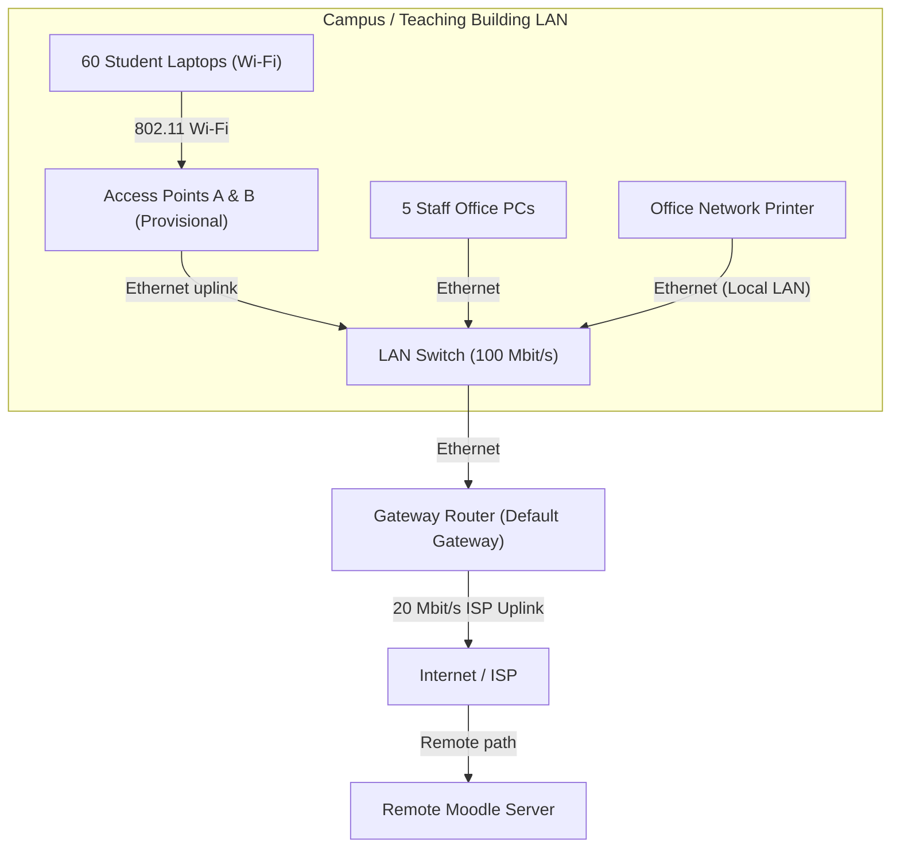

```mermaid
flowchart TD
  subgraph LAN["Campus / Teaching Building LAN"]
    STU["60 Student Laptops (Wi-Fi)"] -->|"802.11 Wi-Fi"| AP["Access Points A & B (Provisional)"]
    AP -->|"Ethernet uplink"| SW["LAN Switch (100 Mbit/s)"]
    PC["5 Staff Office PCs"] -->|"Ethernet"| SW
    PRN["Office Network Printer"] -->|"Ethernet (Local LAN)"| SW
  end

  SW -->|"Ethernet"| GW["Gateway Router (Default Gateway)"]
  GW -->|"20 Mbit/s ISP Uplink"| ISP["Internet / ISP"]
  ISP -->|"Remote path"| MDL["Remote Moodle Server"]
```
