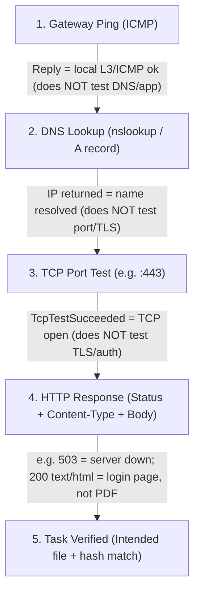

```mermaid
flowchart TD
  P["1. Gateway Ping (ICMP)"] -->|"Reply = local L3/ICMP ok (does NOT test DNS/app)"| D["2. DNS Lookup (nslookup / A record)"]
  D -->|"IP returned = name resolved (does NOT test port/TLS)"| T["3. TCP Port Test (e.g. :443)"]
  T -->|"TcpTestSucceeded = TCP open (does NOT test TLS/auth)"| H["4. HTTP Response (Status + Content-Type + Body)"]
  H -->|"e.g. 503 = server down; 200 text/html = login page, not PDF"| V["5. Task Verified (Intended file + hash match)"]
```
