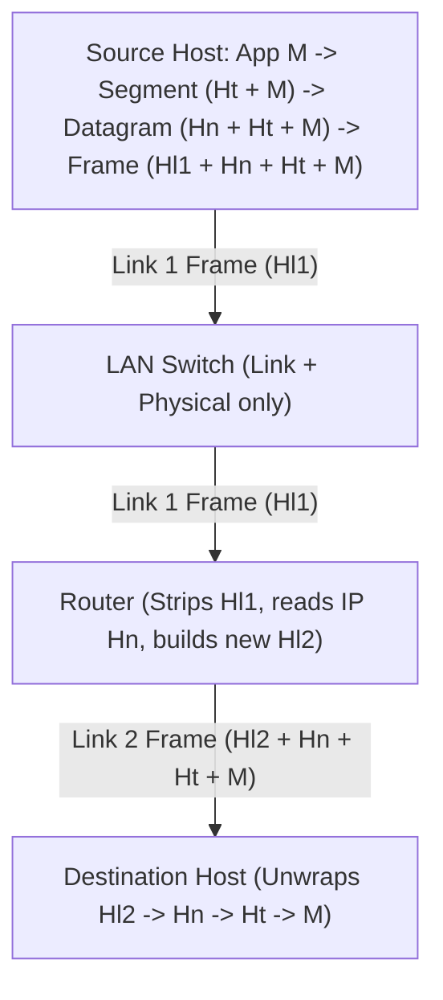

```mermaid
flowchart TD
  SRC["Source Host: App M -> Segment (Ht + M) -> Datagram (Hn + Ht + M) -> Frame (Hl1 + Hn + Ht + M)"]
  SRC -->|"Link 1 Frame (Hl1)"| SW["LAN Switch (Link + Physical only)"]
  SW -->|"Link 1 Frame (Hl1)"| RTR["Router (Strips Hl1, reads IP Hn, builds new Hl2)"]
  RTR -->|"Link 2 Frame (Hl2 + Hn + Ht + M)"| DST["Destination Host (Unwraps Hl2 -> Hn -> Ht -> M)"]
```
