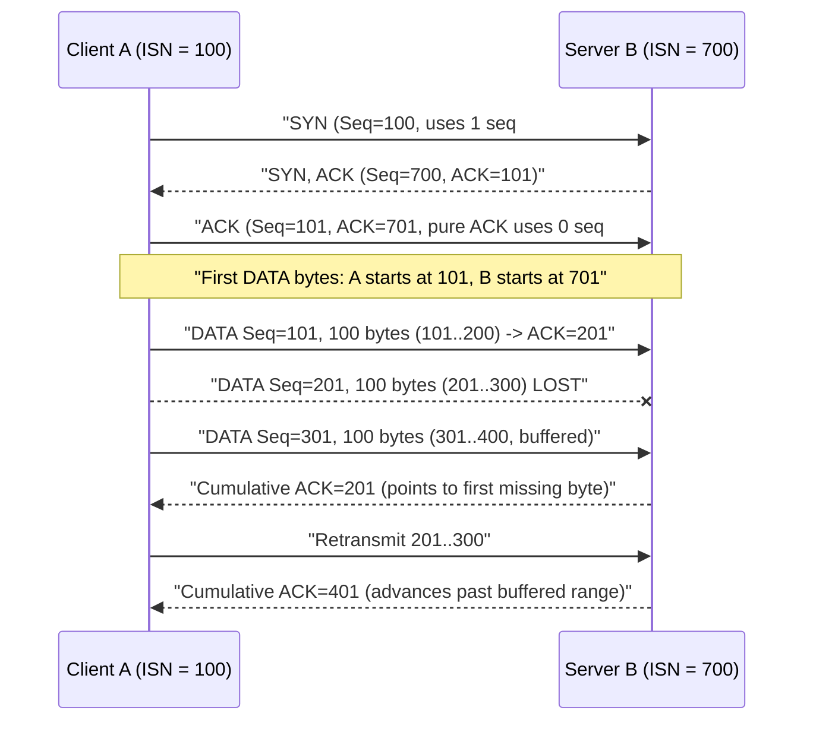

```mermaid
sequenceDiagram
  participant A as Client A (ISN = 100)
  participant B as Server B (ISN = 700)
  A->>B: "SYN (Seq=100, uses 1 seq #)"
  B-->>A: "SYN, ACK (Seq=700, ACK=101)"
  A->>B: "ACK (Seq=101, ACK=701, pure ACK uses 0 seq #)"
  Note over A,B: "First DATA bytes: A starts at 101, B starts at 701"
  A->>B: "DATA Seq=101, 100 bytes (101..200) -> ACK=201"
  A--xB: "DATA Seq=201, 100 bytes (201..300) LOST"
  A->>B: "DATA Seq=301, 100 bytes (301..400, buffered)"
  B-->>A: "Cumulative ACK=201 (points to first missing byte)"
  A->>B: "Retransmit 201..300"
  B-->>A: "Cumulative ACK=401 (advances past buffered range)"
```
