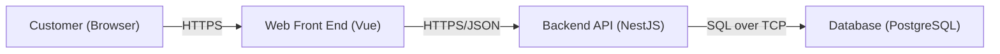

```mermaid
flowchart LR
  U["Customer (Browser)"] -->|"HTTPS"| FE["Web Front End (Vue)"]
  FE -->|"HTTPS/JSON"| API["Backend API (NestJS)"]
  API -->|"SQL over TCP"| DB["Database (PostgreSQL)"]
```
