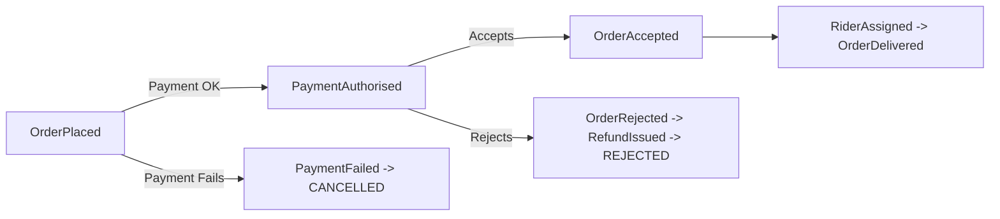

```mermaid
flowchart LR
  OP["OrderPlaced"] -->|"Payment OK"| PA["PaymentAuthorised"]
  OP -->|"Payment Fails"| PF["PaymentFailed -> CANCELLED"]
  PA -->|"Accepts"| OA["OrderAccepted"] --> RA["RiderAssigned -> OrderDelivered"]
  PA -->|"Rejects"| OR["OrderRejected -> RefundIssued -> REJECTED"]
```
