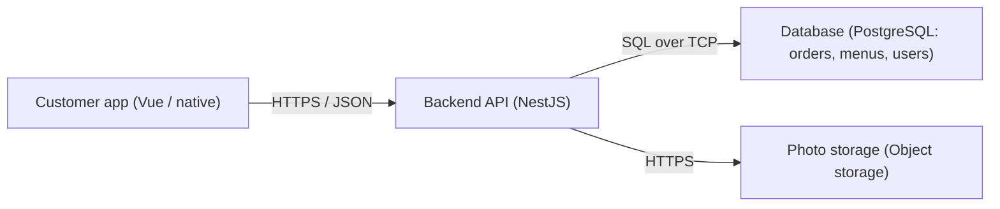

```mermaid
flowchart LR
  CAPP["Customer app (Vue / native)"] -->|"HTTPS / JSON"| API["Backend API (NestJS)"]
  API -->|"SQL over TCP"| DB["Database (PostgreSQL: orders, menus, users)"]
  API -->|"HTTPS"| OBJ["Photo storage (Object storage)"]
```
