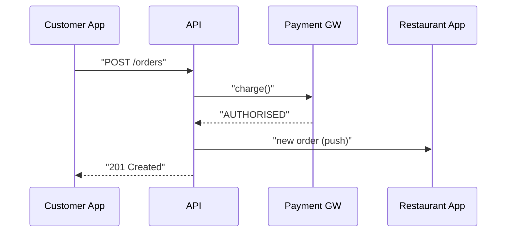

```mermaid
sequenceDiagram
  participant CA as Customer App
  participant API as API
  participant PG as Payment GW
  participant RA as Restaurant App

  CA->>API: "POST /orders"
  API->>PG: "charge()"
  PG-->>API: "AUTHORISED"
  API->>RA: "new order (push)"
  API-->>CA: "201 Created"
```
