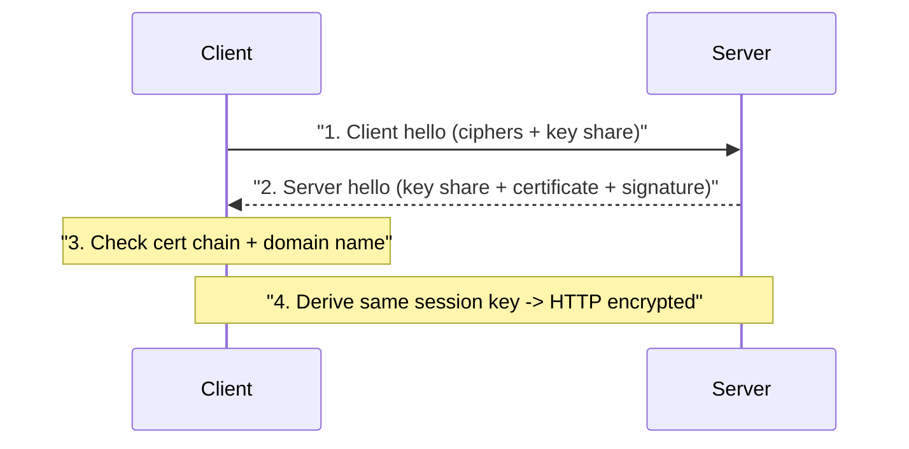

```mermaid
sequenceDiagram
  participant C as Client
  participant S as Server
  C->>S: "1. Client hello (ciphers + key share)"
  S-->>C: "2. Server hello (key share + certificate + signature)"
  Note over C: "3. Check cert chain + domain name"
  Note over C,S: "4. Derive same session key -> HTTP encrypted"
```
