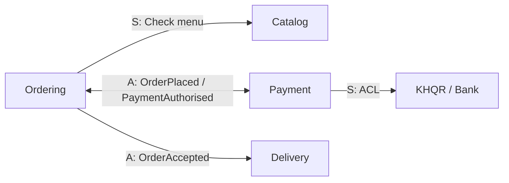

```mermaid
flowchart LR
  ORD["Ordering"] -->|"S: Check menu"| CAT["Catalog"]
  ORD <-->|"A: OrderPlaced / PaymentAuthorised"| PAY["Payment"]
  PAY -->|"S: ACL"| KHQR["KHQR / Bank"]
  ORD -->|"A: OrderAccepted"| DEL["Delivery"]
```
