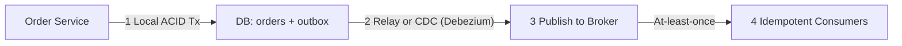

```mermaid
flowchart LR
  SVC["Order Service"] -->|"1 Local ACID Tx"| DB["DB: orders + outbox"]
  DB -->|"2 Relay or CDC (Debezium)"| BRK["3 Publish to Broker"]
  BRK -->|"At-least-once"| CON["4 Idempotent Consumers"]
```
